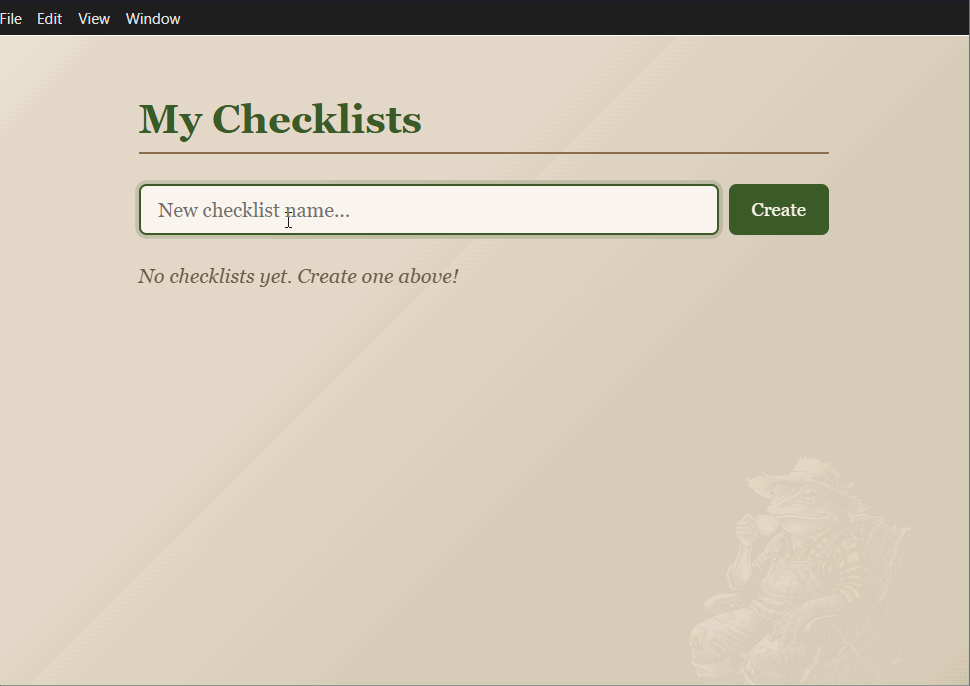

# Checklistorama

A portfolio of checklist applications, each built with a different tech stack. Same concept, different frameworks — a hands-on way to explore and compare modern development tools.

---

## Showcase

### Cozy Checklist

A warm, inviting checklist app with an earthy aesthetic and a friendly frog mascot.

**Tech Stack:** Vue 3 | TypeScript | Vite | Pinia | Vue Router | Electron

<!-- Replace the placeholder below with your actual screenshot or gif -->
<!-- To add a screenshot: save it to docs/images/ and update the path -->


#### Features

- Create, rename, and delete multiple checklists
- Add, check off, and remove items within each checklist
- Strikethrough styling on completed items
- Data persisted to localStorage
- Cozy, warm color palette with serif typography
- Runs as a native desktop app via Electron

#### Running Locally

```sh
cd cozy_checklist
npm install
npm run dev              # Start the Vite dev server
npm run electron:dev     # Launch in Electron (run after dev server is up)
```

---

*More checklist apps coming soon — stay tuned.*

## License

MIT
