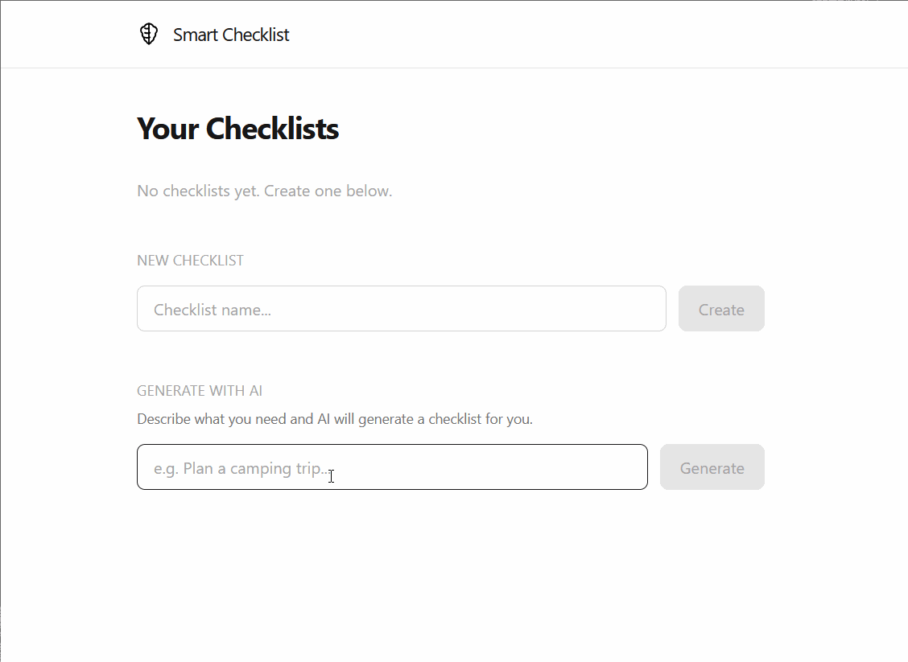
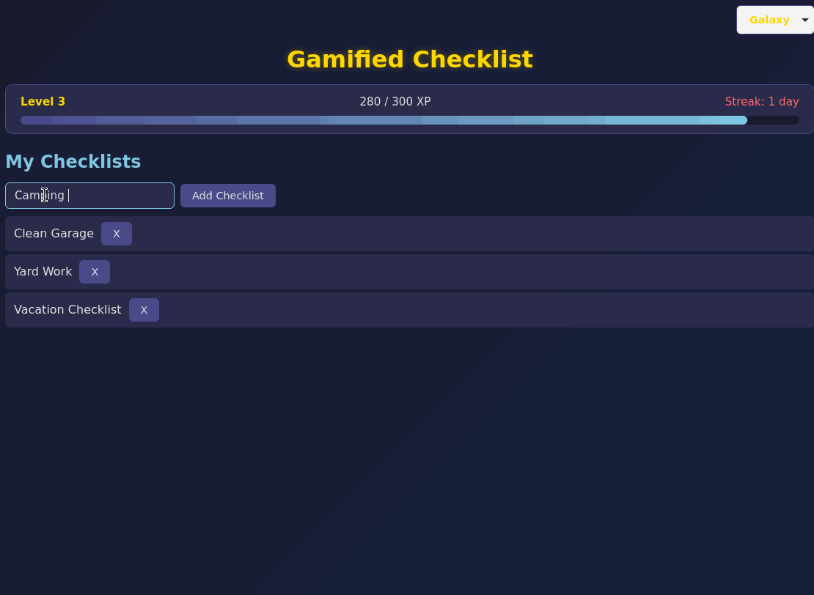

# Checklistorama

A portfolio of checklist applications, each built with a different tech stack. Same concept, different frameworks — a hands-on way to explore and compare modern development tools.

---

## Showcase

### Cozy Checklist

A warm, inviting checklist app with an earthy aesthetic and a friendly frog mascot.

**Tech Stack:** Vue 3 | TypeScript | Vite | Pinia | Vue Router | Electron


#### Features

- Create, rename, and delete multiple checklists
- Add, check off, and remove items within each checklist
- Strikethrough styling on completed items
- Data persisted to localStorage
- Cozy, warm color palette with serif typography
- Runs as a native desktop app via Electron

#### Running Locally

```sh
cd cozy_checklist
npm install
npm run dev              # Start the Vite dev server
npm run electron:dev     # Launch in Electron (run after dev server is up)
```

---

### Smart Checklist

A clean, minimal checklist app with AI-powered checklist generation using a local LLM.

**Tech Stack:** SvelteKit | TypeScript | Tailwind CSS | Drizzle ORM | SQLite | Ollama | Docker



#### Features

- Create, view, and delete checklists
- Add, check off, and remove items
- AI-generated checklists from a text description (powered by Ollama + llama3.2)
- Data persisted in SQLite via Drizzle ORM
- Fully containerized — one `docker compose up` runs the entire stack
- GPU acceleration support for faster AI generation

#### Running Locally

```sh
# With Docker (recommended — no setup needed):
cd smart_checklist
docker compose up

# With GPU:
docker compose -f docker-compose.yml -f docker-compose.gpu.yml up

# Without Docker (manual):
cd smart_checklist
npm install
ollama pull llama3.2     # Download the AI model
npm run dev              # Start the dev server
```

---

### Gamified Checklist

A game-themed checklist app with XP, levels, streaks, and swappable visual themes.

**Tech Stack:** React | TypeScript | Vite | Tauri (Rust)



#### Features

- Create, delete, and switch between multiple checklists
- Add, check off, and remove items within each checklist
- Strikethrough styling on completed items
- Gamification — earn 10 XP per completed item, level up, and track daily streaks
- XP progress bar and player stats display
- Swappable themes: Galaxy, Mario, and Zelda
- Data and theme preference persisted to localStorage
- Runs as a native desktop app via Tauri

#### Running Locally

```sh
cd gamified_checklist
npm install
npm run tauri dev        # Launch in Tauri dev mode
```

---

## License

MIT
